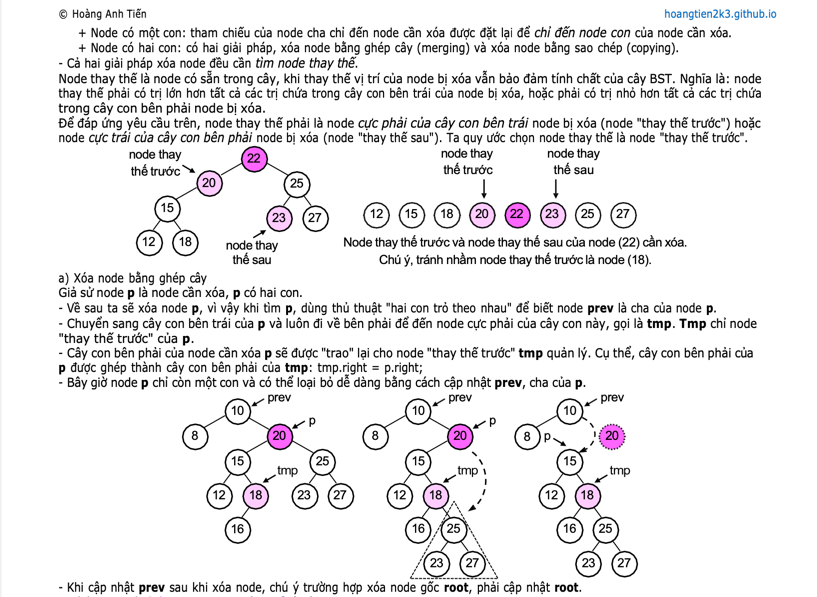

<p align="center">
  
  </br>
</p>

<p align="center">
  
  
</p>

<p align="center">
  
  
  
  
  
  
  
  
  
  
  
  
  
</p>

## Contributors ✨

<a href="https://github.com/hoangtien2k3/fw-commons/graphs/contributors">
  
</a>

## License

This project is licensed under the [`MIT License`](LICENSE).

```text
MIT License
Copyright (c) 2024 Hoàng Anh Tiến
```